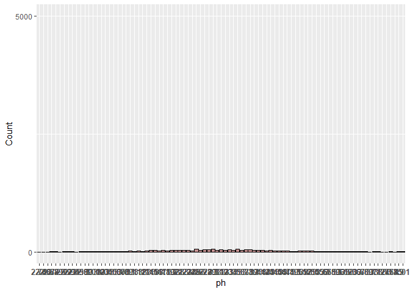

Untitled
================

# Ayudantia 9 Regresion Lineal y Regresion Logistica

## Cargar Librerias

``` r
library(tidyverse)
library(GGally)
library(regclass)
library(pROC)
library(rsample)
```

## Cargar Datos

``` r
setwd("D:/U/mineria de datos/Ayudantia_DataMining01_2021/Ayudantia 9")

toyota <- read.csv("toyota.csv")
vinos <- read.csv("winequality-red.csv")
```

En esta ayudantia veremos los dos modelos de regresion que suelen ser
los mas conocidos o que se tiene la costumbre de utilizar en modelos
supervisados, para ello se utilizaran dos datasets en esta ayudantia.

## Regresion Lineal

El primero que veremos será un dataset de los autos usados del
fabricante toyota (link en bloc de notas), y lo utilizaremos para
realizar un analisis

# Simple (Precio Auto)

``` r
summary(toyota)
```

    ##     model                year          price       transmission      
    ##  Length:6738        Min.   :1998   Min.   :  850   Length:6738       
    ##  Class :character   1st Qu.:2016   1st Qu.: 8290   Class :character  
    ##  Mode  :character   Median :2017   Median :10795   Mode  :character  
    ##                     Mean   :2017   Mean   :12522                     
    ##                     3rd Qu.:2018   3rd Qu.:14995                     
    ##                     Max.   :2020   Max.   :59995                     
    ##     mileage         fuelType              tax             mpg        
    ##  Min.   :     2   Length:6738        Min.   :  0.0   Min.   :  2.80  
    ##  1st Qu.:  9446   Class :character   1st Qu.:  0.0   1st Qu.: 55.40  
    ##  Median : 18513   Mode  :character   Median :135.0   Median : 62.80  
    ##  Mean   : 22857                      Mean   : 94.7   Mean   : 63.04  
    ##  3rd Qu.: 31064                      3rd Qu.:145.0   3rd Qu.: 69.00  
    ##  Max.   :174419                      Max.   :565.0   Max.   :235.00  
    ##    engineSize   
    ##  Min.   :0.000  
    ##  1st Qu.:1.000  
    ##  Median :1.500  
    ##  Mean   :1.471  
    ##  3rd Qu.:1.800  
    ##  Max.   :4.500

``` r
toyota %>% head()
```

    ##   model year price transmission mileage fuelType tax  mpg engineSize
    ## 1  GT86 2016 16000       Manual   24089   Petrol 265 36.2          2
    ## 2  GT86 2017 15995       Manual   18615   Petrol 145 36.2          2
    ## 3  GT86 2015 13998       Manual   27469   Petrol 265 36.2          2
    ## 4  GT86 2017 18998       Manual   14736   Petrol 150 36.2          2
    ## 5  GT86 2017 17498       Manual   36284   Petrol 145 36.2          2
    ## 6  GT86 2017 15998       Manual   26919   Petrol 260 36.2          2

Este dataset contiene informacion sobre el modelo del auto, año, precio,
transmision, kilometraje, mpg (millas por galon), tipo de combustible,
impuesto de circulacion, y tamaño del motor. (La data ya esta limpiada
en cuanto a datos duplicados y columnas relevantes).

En este analisis lo que buscaremos es predecir el precio al que
podriamos vender mi auto en caso de tener un toyota en UK.

Para esto transformamos las variables del modelo, transmision y tipo de
combustible, a factores para trabajar con dichos valores como
“etiquetas”

``` r
toyota$model <- as.factor(toyota$model)
toyota$transmission <- as.factor(toyota$transmission)
toyota$fuelType <- as.factor(toyota$fuelType)

summary(toyota)
```

    ##       model           year          price          transmission 
    ##   Yaris  :2122   Min.   :1998   Min.   :  850   Automatic:2657  
    ##   Aygo   :1961   1st Qu.:2016   1st Qu.: 8290   Manual   :3826  
    ##   Auris  : 712   Median :2017   Median :10795   Other    :   1  
    ##   C-HR   : 479   Mean   :2017   Mean   :12522   Semi-Auto: 254  
    ##   RAV4   : 473   3rd Qu.:2018   3rd Qu.:14995                   
    ##   Corolla: 267   Max.   :2020   Max.   :59995                   
    ##  (Other) : 724                                                  
    ##     mileage         fuelType         tax             mpg        
    ##  Min.   :     2   Diesel: 503   Min.   :  0.0   Min.   :  2.80  
    ##  1st Qu.:  9446   Hybrid:2043   1st Qu.:  0.0   1st Qu.: 55.40  
    ##  Median : 18513   Other : 105   Median :135.0   Median : 62.80  
    ##  Mean   : 22857   Petrol:4087   Mean   : 94.7   Mean   : 63.04  
    ##  3rd Qu.: 31064                 3rd Qu.:145.0   3rd Qu.: 69.00  
    ##  Max.   :174419                 Max.   :565.0   Max.   :235.00  
    ##                                                                 
    ##    engineSize   
    ##  Min.   :0.000  
    ##  1st Qu.:1.000  
    ##  Median :1.500  
    ##  Mean   :1.471  
    ##  3rd Qu.:1.800  
    ##  Max.   :4.500  
    ## 

Podemos ver que un valor en el tamaño del motor de 0 no tiene mucho
sentido por lo que revisaremos cuantas observaciones presentan este este
valor, y en caso de haber datos con valor 0 los eliminamos de nuestro
dataset Corroboramos la existencia de valores na y nulos para ver si es
necesario hacer esa limpieza.

``` r
toyota %>% filter(engineSize == 0) %>% nrow()
```

    ## [1] 6

``` r
toyota <- toyota %>%  filter(engineSize != 0)

summary(toyota)
```

    ##       model           year          price          transmission 
    ##   Yaris  :2120   Min.   :1998   Min.   :  850   Automatic:2656  
    ##   Aygo   :1958   1st Qu.:2016   1st Qu.: 8290   Manual   :3821  
    ##   Auris  : 712   Median :2017   Median :10795   Other    :   1  
    ##   C-HR   : 478   Mean   :2017   Mean   :12524   Semi-Auto: 254  
    ##   RAV4   : 473   3rd Qu.:2018   3rd Qu.:14995                   
    ##   Corolla: 267   Max.   :2020   Max.   :59995                   
    ##  (Other) : 724                                                  
    ##     mileage         fuelType         tax              mpg        
    ##  Min.   :     2   Diesel: 503   Min.   :  0.00   Min.   :  2.80  
    ##  1st Qu.:  9448   Hybrid:2041   1st Qu.:  0.00   1st Qu.: 55.40  
    ##  Median : 18516   Other : 105   Median :135.00   Median : 62.80  
    ##  Mean   : 22861   Petrol:4083   Mean   : 94.69   Mean   : 63.04  
    ##  3rd Qu.: 31061                 3rd Qu.:145.00   3rd Qu.: 69.00  
    ##  Max.   :174419                 Max.   :565.00   Max.   :235.00  
    ##                                                                  
    ##    engineSize   
    ##  Min.   :1.000  
    ##  1st Qu.:1.000  
    ##  Median :1.500  
    ##  Mean   :1.473  
    ##  3rd Qu.:1.800  
    ##  Max.   :4.500  
    ## 

``` r
sum(is.na(toyota))
```

    ## [1] 0

``` r
sum(is.null(toyota))
```

    ## [1] 0

Una vez ya listo nuestro datos, realizamos una visualizacion de nuestro
datos numericos, para ver la correlacion que pueda existir entre las
variables y la distribucion de los datos.

``` r
toyota %>% select(year, mileage, tax, mpg, engineSize, price) %>% 
  ggpairs(lower = list(continuous = wrap("points", alpha = 0.3, size = 0.5)))
```

<!-- -->

Revisamos como se distribuyen los datos que pasamos a factor en relacion
al precio, para esto utilizamos los boxplot lo que tambien nos ayudara a
ver si existen valores atipicos que puedan alterar nuestro modelo

``` r
toyota %>% 
  ggplot(aes(transmission, price)) +
  geom_boxplot()
```

<!-- -->

``` r
toyota %>% 
  ggplot(aes(fuelType, price)) +
  geom_boxplot()
```

<!-- -->

``` r
toyota %>% 
  ggplot(aes(mileage, price)) +
  geom_boxplot()
```

    ## Warning: Continuous x aesthetic -- did you forget aes(group=...)?

<!-- -->

``` r
toyota %>% mutate(model = reorder(model, price)) %>%
  ggplot(aes(price, model)) +
  geom_boxplot()
```

<!-- -->

Graficamos las cuatro variables con mayores valores (no consideramos los
tax) para ver como se distributen con el precio

``` r
toyota %>% ggplot(aes(mileage, price)) +
  geom_point(alpha = .1) +
  stat_smooth(method = "gam", formula = y ~ s(x, k=3))
```

<!-- -->

``` r
toyota %>% ggplot(aes(year, price)) +
  geom_point(alpha = .1) +
  stat_smooth(method = "gam", formula = y ~ s(x, k=3))
```

<!-- -->

``` r
toyota %>% ggplot(aes(mpg, price)) +
  geom_point(alpha = .1) +
  stat_smooth(method = "gam", formula = y ~ s(x, k=3))
```

<!-- -->

``` r
toyota %>% ggplot(aes(engineSize, price)) +
  geom_point(alpha = .1) +
  stat_smooth(method = "gam", formula = y ~ s(x, k=3))
```

<!-- -->

``` r
toyota %>% filter(., year >= 2005) %>% ggplot(aes(year, price)) +
  geom_point(alpha = .1) +
  stat_smooth(method = "gam", formula = y ~ s(x, k=3))
```

<!-- -->

Escalamos los datos antes de ralizar el analisis de regresion

``` r
toyota_sca <- toyota
toyota_sca[,c(2,3,5,7,8,9)] <- scale(toyota_sca[,c(2,3,5,7,8,9)])

toyota_sca %>%  head()
```

    ##   model       year     price transmission     mileage fuelType       tax
    ## 1  GT86 -0.3390016 0.5476207       Manual  0.06418306   Petrol 2.3050056
    ## 2  GT86  0.1146177 0.5468329       Manual -0.22202169   Petrol 0.6808592
    ## 3  GT86 -0.7926209 0.2322067       Manual  0.24090429   Petrol 2.3050056
    ## 4  GT86  0.1146177 1.0199538       Manual -0.42483283   Petrol 0.7485320
    ## 5  GT86  0.1146177 0.7836297       Manual  0.70179118   Petrol 0.6808592
    ## 6  GT86  0.1146177 0.5473056       Manual  0.21214788   Petrol 2.2373329
    ##         mpg engineSize
    ## 1 -1.694806   1.214812
    ## 2 -1.694806   1.214812
    ## 3 -1.694806   1.214812
    ## 4 -1.694806   1.214812
    ## 5 -1.694806   1.214812
    ## 6 -1.694806   1.214812

Primero veremos el caso de una regresion simple, donde solo
consideraremos el kilometraje para predecir el precio de nuesto vhiculo

``` r
reg_simp <- lm(price ~ mileage, data = toyota)
summary(reg_simp)
```

    ## 
    ## Call:
    ## lm(formula = price ~ mileage, data = toyota)
    ## 
    ## Residuals:
    ##    Min     1Q Median     3Q    Max 
    ## -10013  -4437  -1910   2991  46188 
    ## 
    ## Coefficients:
    ##               Estimate Std. Error t value Pr(>|t|)    
    ## (Intercept)  1.479e+04  1.151e+02  128.50   <2e-16 ***
    ## mileage     -9.901e-02  3.861e-03  -25.64   <2e-16 ***
    ## ---
    ## Signif. codes:  0 '***' 0.001 '**' 0.01 '*' 0.05 '.' 0.1 ' ' 1
    ## 
    ## Residual standard error: 6059 on 6730 degrees of freedom
    ## Multiple R-squared:  0.08901,    Adjusted R-squared:  0.08888 
    ## F-statistic: 657.6 on 1 and 6730 DF,  p-value: < 2.2e-16

Los resultados de la regresion nos indican que los valores de los
parametros son 1.479^-2 para el intercepto y -0.0901 para el coeficiente
asociado a la variable superficie de terreno.

Tambien se puede observar que el coeficiente de determinacion R2 es de
0.0888, lo que significa que el 8% de la varianza del precio esta
explicada por el modelo lineal.

Veamos que pasa ahora al considerar mas variables en nuestro modelo de
regresion, para eso consideraremos el modelo, el año, su kilometraje, el
tamaño del motor y las millas por galon.

``` r
reg_mult <- lm(price ~ model + year*mileage + engineSize + mpg, data = toyota_sca)
summary(reg_mult)
```

    ## 
    ## Call:
    ## lm(formula = price ~ model + year * mileage + engineSize + mpg, 
    ##     data = toyota_sca)
    ## 
    ## Residuals:
    ##      Min       1Q   Median       3Q      Max 
    ## -2.87872 -0.16417 -0.02289  0.14310  2.91021 
    ## 
    ## Coefficients:
    ##                      Estimate Std. Error t value Pr(>|t|)    
    ## (Intercept)         -0.001391   0.012592  -0.110  0.91207    
    ## model Avensis       -0.282469   0.031308  -9.022  < 2e-16 ***
    ## model Aygo          -0.327626   0.021985 -14.902  < 2e-16 ***
    ## model C-HR           0.890092   0.018572  47.927  < 2e-16 ***
    ## model Camry          0.727859   0.095175   7.648 2.34e-14 ***
    ## model Corolla        0.713442   0.023484  30.380  < 2e-16 ***
    ## model GT86           0.573701   0.040290  14.239  < 2e-16 ***
    ## model Hilux          0.426034   0.043258   9.849  < 2e-16 ***
    ## model IQ             0.110512   0.109436   1.010  0.31262    
    ## model Land Cruiser   2.503718   0.056755  44.115  < 2e-16 ***
    ## model Prius          0.703969   0.024537  28.691  < 2e-16 ***
    ## model PROACE VERSO   1.554445   0.080749  19.250  < 2e-16 ***
    ## model RAV4           0.308238   0.024964  12.347  < 2e-16 ***
    ## model Supra          3.976318   0.096118  41.369  < 2e-16 ***
    ## model Urban Cruiser -0.164767   0.152913  -1.078  0.28129    
    ## model Verso         -0.081461   0.031494  -2.587  0.00972 ** 
    ## model Verso-S        0.049601   0.176269   0.281  0.77842    
    ## model Yaris         -0.271531   0.014861 -18.271  < 2e-16 ***
    ## year                 0.253938   0.006011  42.249  < 2e-16 ***
    ## mileage             -0.226710   0.005921 -38.288  < 2e-16 ***
    ## engineSize           0.463494   0.010908  42.493  < 2e-16 ***
    ## mpg                  0.057956   0.005039  11.501  < 2e-16 ***
    ## year:mileage        -0.011753   0.002145  -5.478 4.46e-08 ***
    ## ---
    ## Signif. codes:  0 '***' 0.001 '**' 0.01 '*' 0.05 '.' 0.1 ' ' 1
    ## 
    ## Residual standard error: 0.3041 on 6709 degrees of freedom
    ## Multiple R-squared:  0.9078, Adjusted R-squared:  0.9075 
    ## F-statistic:  3004 on 22 and 6709 DF,  p-value: < 2.2e-16

Los resultados de la regresion multiple no muestran un coeficiente de
determinacion del 90%, y se puede ver que todas las variables son
significativas a excepcion de algunos modelos de autos que no tienen
significancia para nuestro modelo.

Revisamos el valor del facto de inflacion de la varianza, este factor
nos permite entender la colinealidad de los datos.

Un VIF por encima de 4 o una tolerancia por debajo de 0,25 indica que
podría existir multicolinealidad y se requiere más investigación.

``` r
VIF(reg_mult)
```

    ##                   GVIF Df GVIF^(1/(2*Df))
    ## model        17.256587 17        1.087379
    ## year          2.629541  1        1.621586
    ## mileage       2.551935  1        1.597478
    ## engineSize    8.659920  1        2.942774
    ## mpg           1.848271  1        1.359511
    ## year:mileage  1.961630  1        1.400582

``` r
library(olsrr)
```

    ## Warning: package 'olsrr' was built under R version 4.0.5

    ## 
    ## Attaching package: 'olsrr'

    ## The following object is masked from 'package:datasets':
    ## 
    ##     rivers

``` r
fuerza_bruta <- ols_step_all_possible(reg_mult)

plot(fuerza_bruta)
```

<!-- --><!-- -->

## Regresion Logistica (vinos)

Para el segundo modelo que veremos se utilizara un sample de un dataset
con informacion sobre vinos

``` r
summary(vinos)
```

    ##  fixed.acidity   volatile.acidity  citric.acid    residual.sugar  
    ##  Min.   : 4.60   Min.   :0.1200   Min.   :0.000   Min.   : 0.900  
    ##  1st Qu.: 7.10   1st Qu.:0.3900   1st Qu.:0.090   1st Qu.: 1.900  
    ##  Median : 7.90   Median :0.5200   Median :0.260   Median : 2.200  
    ##  Mean   : 8.32   Mean   :0.5278   Mean   :0.271   Mean   : 2.539  
    ##  3rd Qu.: 9.20   3rd Qu.:0.6400   3rd Qu.:0.420   3rd Qu.: 2.600  
    ##  Max.   :15.90   Max.   :1.5800   Max.   :1.000   Max.   :15.500  
    ##    chlorides       free.sulfur.dioxide total.sulfur.dioxide    density      
    ##  Min.   :0.01200   Min.   : 1.00       Min.   :  6.00       Min.   :0.9901  
    ##  1st Qu.:0.07000   1st Qu.: 7.00       1st Qu.: 22.00       1st Qu.:0.9956  
    ##  Median :0.07900   Median :14.00       Median : 38.00       Median :0.9968  
    ##  Mean   :0.08747   Mean   :15.87       Mean   : 46.47       Mean   :0.9967  
    ##  3rd Qu.:0.09000   3rd Qu.:21.00       3rd Qu.: 62.00       3rd Qu.:0.9978  
    ##  Max.   :0.61100   Max.   :72.00       Max.   :289.00       Max.   :1.0037  
    ##        pH          sulphates         alcohol         quality     
    ##  Min.   :2.740   Min.   :0.3300   Min.   : 8.40   Min.   :3.000  
    ##  1st Qu.:3.210   1st Qu.:0.5500   1st Qu.: 9.50   1st Qu.:5.000  
    ##  Median :3.310   Median :0.6200   Median :10.20   Median :6.000  
    ##  Mean   :3.311   Mean   :0.6581   Mean   :10.42   Mean   :5.636  
    ##  3rd Qu.:3.400   3rd Qu.:0.7300   3rd Qu.:11.10   3rd Qu.:6.000  
    ##  Max.   :4.010   Max.   :2.0000   Max.   :14.90   Max.   :8.000

``` r
vinos %>% head()
```

    ##   fixed.acidity volatile.acidity citric.acid residual.sugar chlorides
    ## 1           7.4             0.70        0.00            1.9     0.076
    ## 2           7.8             0.88        0.00            2.6     0.098
    ## 3           7.8             0.76        0.04            2.3     0.092
    ## 4          11.2             0.28        0.56            1.9     0.075
    ## 5           7.4             0.70        0.00            1.9     0.076
    ## 6           7.4             0.66        0.00            1.8     0.075
    ##   free.sulfur.dioxide total.sulfur.dioxide density   pH sulphates alcohol
    ## 1                  11                   34  0.9978 3.51      0.56     9.4
    ## 2                  25                   67  0.9968 3.20      0.68     9.8
    ## 3                  15                   54  0.9970 3.26      0.65     9.8
    ## 4                  17                   60  0.9980 3.16      0.58     9.8
    ## 5                  11                   34  0.9978 3.51      0.56     9.4
    ## 6                  13                   40  0.9978 3.51      0.56     9.4
    ##   quality
    ## 1       5
    ## 2       5
    ## 3       5
    ## 4       6
    ## 5       5
    ## 6       5

``` r
glimpse(vinos)
```

    ## Rows: 1,599
    ## Columns: 12
    ## $ fixed.acidity        <dbl> 7.4, 7.8, 7.8, 11.2, 7.4, 7.4, 7.9, 7.3, 7.8, ...
    ## $ volatile.acidity     <dbl> 0.700, 0.880, 0.760, 0.280, 0.700, 0.660, 0.60...
    ## $ citric.acid          <dbl> 0.00, 0.00, 0.04, 0.56, 0.00, 0.00, 0.06, 0.00...
    ## $ residual.sugar       <dbl> 1.9, 2.6, 2.3, 1.9, 1.9, 1.8, 1.6, 1.2, 2.0, 6...
    ## $ chlorides            <dbl> 0.076, 0.098, 0.092, 0.075, 0.076, 0.075, 0.06...
    ## $ free.sulfur.dioxide  <dbl> 11, 25, 15, 17, 11, 13, 15, 15, 9, 17, 15, 17,...
    ## $ total.sulfur.dioxide <dbl> 34, 67, 54, 60, 34, 40, 59, 21, 18, 102, 65, 1...
    ## $ density              <dbl> 0.9978, 0.9968, 0.9970, 0.9980, 0.9978, 0.9978...
    ## $ pH                   <dbl> 3.51, 3.20, 3.26, 3.16, 3.51, 3.51, 3.30, 3.39...
    ## $ sulphates            <dbl> 0.56, 0.68, 0.65, 0.58, 0.56, 0.56, 0.46, 0.47...
    ## $ alcohol              <dbl> 9.4, 9.8, 9.8, 9.8, 9.4, 9.4, 9.4, 10.0, 9.5, ...
    ## $ quality              <int> 5, 5, 5, 6, 5, 5, 5, 7, 7, 5, 5, 5, 5, 5, 5, 5...

``` r
ggplot(vinos,aes(x=factor(pH))) +
  geom_bar(col ="black",fill="#993333",alpha=0.5) +
  theme(axis.text.x = element_text(face="bold", size=10)) +
  scale_x_discrete("PH") +
  scale_y_continuous("Count")
```

<!-- -->

``` r
ggplot(vinos,aes(factor(quality))) +
  geom_bar(col ="black",fill="#993333",alpha=0.5) +
  theme(axis.text.x = element_text(face="bold", size=8, angle=30)) +
  scale_y_continuous("Count",limits = c(0,1500),breaks=seq(0,15000,by=1500)) +
  scale_x_discrete("quality")
```

<!-- -->

``` r
#d <- vinos %>% 
 # group_by(quality) %>%
#  count() %>%
#  arrange(match(arrival_date_month,month.name))
#d <- data.frame(ArrivalDateMonth = d$arrival_date_month,N =d$n)
#d
```

``` r
ggplot(data = vinos,aes(factor(pH)))+
  geom_bar( col='black', fill="#993333", alpha = 0.5) +
    scale_x_discrete("ph") +
  scale_y_continuous("Count",limits = c(0,5000),breaks=seq(0,47222,by=5000))  +
  theme(axis.text.x = element_text(face="bold", size=10))
```

<!-- -->

``` r
acidityRate <- vinos %>%
    summarise(fixed.acidity) 
acidityRate <- as.data.frame(acidityRate)
acidityRate
```

    ##      fixed.acidity
    ## 1              7.4
    ## 2              7.8
    ## 3              7.8
    ## 4             11.2
    ## 5              7.4
    ## 6              7.4
    ## 7              7.9
    ## 8              7.3
    ## 9              7.8
    ## 10             7.5
    ## 11             6.7
    ## 12             7.5
    ## 13             5.6
    ## 14             7.8
    ## 15             8.9
    ## 16             8.9
    ## 17             8.5
    ## 18             8.1
    ## 19             7.4
    ## 20             7.9
    ## 21             8.9
    ## 22             7.6
    ## 23             7.9
    ## 24             8.5
    ## 25             6.9
    ## 26             6.3
    ## 27             7.6
    ## 28             7.9
    ## 29             7.1
    ## 30             7.8
    ## 31             6.7
    ## 32             6.9
    ## 33             8.3
    ## 34             6.9
    ## 35             5.2
    ## 36             7.8
    ## 37             7.8
    ## 38             8.1
    ## 39             5.7
    ## 40             7.3
    ## 41             7.3
    ## 42             8.8
    ## 43             7.5
    ## 44             8.1
    ## 45             6.8
    ## 46             4.6
    ## 47             7.7
    ## 48             8.7
    ## 49             6.4
    ## 50             5.6
    ## 51             8.8
    ## 52             6.6
    ## 53             6.6
    ## 54             8.6
    ## 55             7.6
    ## 56             7.7
    ## 57            10.2
    ## 58             7.5
    ## 59             7.8
    ## 60             7.3
    ## 61             8.8
    ## 62             7.7
    ## 63             7.5
    ## 64             7.0
    ## 65             7.2
    ## 66             7.2
    ## 67             7.5
    ## 68             6.6
    ## 69             9.3
    ## 70             8.0
    ## 71             7.7
    ## 72             7.7
    ## 73             7.7
    ## 74             8.3
    ## 75             9.7
    ## 76             8.8
    ## 77             8.8
    ## 78             6.8
    ## 79             6.7
    ## 80             8.3
    ## 81             6.2
    ## 82             7.8
    ## 83             7.4
    ## 84             7.3
    ## 85             6.3
    ## 86             6.9
    ## 87             8.6
    ## 88             7.7
    ## 89             9.3
    ## 90             7.0
    ## 91             7.9
    ## 92             8.6
    ## 93             8.6
    ## 94             7.7
    ## 95             5.0
    ## 96             4.7
    ## 97             6.8
    ## 98             7.0
    ## 99             7.6
    ## 100            8.1
    ## 101            8.3
    ## 102            7.8
    ## 103            8.1
    ## 104            8.1
    ## 105            7.2
    ## 106            8.1
    ## 107            7.8
    ## 108            6.2
    ## 109            8.0
    ## 110            8.1
    ## 111            7.8
    ## 112            8.4
    ## 113            8.4
    ## 114           10.1
    ## 115            7.8
    ## 116            9.4
    ## 117            8.3
    ## 118            7.8
    ## 119            8.8
    ## 120            7.0
    ## 121            7.3
    ## 122            8.8
    ## 123            7.3
    ## 124            8.0
    ## 125            7.8
    ## 126            9.0
    ## 127            8.2
    ## 128            8.1
    ## 129            8.0
    ## 130            6.1
    ## 131            8.0
    ## 132            5.6
    ## 133            5.6
    ## 134            6.6
    ## 135            7.9
    ## 136            8.4
    ## 137            8.3
    ## 138            7.2
    ## 139            7.8
    ## 140            7.8
    ## 141            8.4
    ## 142            8.3
    ## 143            5.2
    ## 144            6.3
    ## 145            5.2
    ## 146            8.1
    ## 147            5.8
    ## 148            7.6
    ## 149            6.9
    ## 150            8.2
    ## 151            7.3
    ## 152            9.2
    ## 153            7.5
    ## 154            7.5
    ## 155            7.1
    ## 156            7.1
    ## 157            7.1
    ## 158            7.1
    ## 159            7.1
    ## 160            6.8
    ## 161            7.6
    ## 162            7.6
    ## 163            7.8
    ## 164            7.4
    ## 165            7.3
    ## 166            7.8
    ## 167            6.8
    ## 168            7.3
    ## 169            6.8
    ## 170            7.5
    ## 171            7.9
    ## 172            8.0
    ## 173            8.0
    ## 174            7.4
    ## 175            7.3
    ## 176            6.9
    ## 177            7.3
    ## 178            7.5
    ## 179            7.0
    ## 180            8.8
    ## 181            8.8
    ## 182            8.9
    ## 183            7.2
    ## 184            6.8
    ## 185            6.7
    ## 186            8.9
    ## 187            7.4
    ## 188            7.7
    ## 189            7.9
    ## 190            7.9
    ## 191            8.2
    ## 192            6.4
    ## 193            6.8
    ## 194            7.6
    ## 195            7.6
    ## 196            7.8
    ## 197            7.3
    ## 198           11.5
    ## 199            5.4
    ## 200            6.9
    ## 201            9.6
    ## 202            8.8
    ## 203            6.8
    ## 204            7.0
    ## 205            7.0
    ## 206           12.8
    ## 207           12.8
    ## 208            7.8
    ## 209            7.8
    ## 210           11.0
    ## 211            9.7
    ## 212            8.0
    ## 213           11.6
    ## 214            8.2
    ## 215            7.8
    ## 216            7.0
    ## 217            8.7
    ## 218            8.1
    ## 219            7.5
    ## 220            7.8
    ## 221            7.8
    ## 222            7.4
    ## 223            6.8
    ## 224            8.6
    ## 225            8.4
    ## 226            7.7
    ## 227            8.9
    ## 228            9.0
    ## 229            7.7
    ## 230            6.9
    ## 231            5.2
    ## 232            8.0
    ## 233            8.5
    ## 234            6.9
    ## 235            8.2
    ## 236            7.2
    ## 237            7.2
    ## 238            7.2
    ## 239            7.2
    ## 240            8.2
    ## 241            8.9
    ## 242           12.0
    ## 243            7.7
    ## 244           15.0
    ## 245           15.0
    ## 246            7.3
    ## 247            7.1
    ## 248            8.2
    ## 249            7.7
    ## 250            7.3
    ## 251           10.8
    ## 252            7.1
    ## 253           11.1
    ## 254            7.7
    ## 255            7.1
    ## 256            8.0
    ## 257            9.4
    ## 258            6.6
    ## 259            7.7
    ## 260           10.0
    ## 261            7.9
    ## 262            7.0
    ## 263            8.0
    ## 264            7.9
    ## 265           12.5
    ## 266           11.8
    ## 267            8.1
    ## 268            7.9
    ## 269            6.9
    ## 270           11.5
    ## 271            7.9
    ## 272           11.5
    ## 273           10.9
    ## 274            8.4
    ## 275            7.5
    ## 276            7.9
    ## 277            6.9
    ## 278           11.5
    ## 279           10.3
    ## 280            8.9
    ## 281           11.4
    ## 282            7.7
    ## 283            7.6
    ## 284            8.9
    ## 285            9.9
    ## 286            9.9
    ## 287           12.0
    ## 288            7.5
    ## 289            8.7
    ## 290           11.6
    ## 291            8.7
    ## 292           11.0
    ## 293           10.4
    ## 294            6.9
    ## 295           13.3
    ## 296           10.8
    ## 297           10.6
    ## 298            7.1
    ## 299            7.2
    ## 300            6.9
    ## 301            7.5
    ## 302           11.1
    ## 303            8.3
    ## 304            7.4
    ## 305            8.4
    ## 306           10.3
    ## 307            7.6
    ## 308           10.3
    ## 309           10.3
    ## 310            7.4
    ## 311           10.3
    ## 312            7.9
    ## 313            9.0
    ## 314            8.6
    ## 315            7.4
    ## 316            7.1
    ## 317            9.6
    ## 318            9.6
    ## 319            9.8
    ## 320            9.6
    ## 321            9.8
    ## 322            9.3
    ## 323            7.8
    ## 324           10.3
    ## 325           10.0
    ## 326           10.0
    ## 327           11.6
    ## 328           10.3
    ## 329           13.4
    ## 330           10.7
    ## 331           10.2
    ## 332           10.2
    ## 333            8.0
    ## 334            8.4
    ## 335            7.9
    ## 336           11.9
    ## 337            8.9
    ## 338            7.8
    ## 339           12.4
    ## 340           12.5
    ## 341           12.2
    ## 342           10.6
    ## 343           10.9
    ## 344           10.9
    ## 345           11.9
    ## 346            7.0
    ## 347            6.6
    ## 348           13.8
    ## 349            9.6
    ## 350            9.1
    ## 351           10.7
    ## 352            9.1
    ## 353            7.7
    ## 354           13.5
    ## 355            6.1
    ## 356            6.7
    ## 357           11.5
    ## 358           10.5
    ## 359           11.9
    ## 360           12.6
    ## 361            8.2
    ## 362            8.6
    ## 363           11.9
    ## 364           12.5
    ## 365           12.8
    ## 366           10.0
    ## 367           12.8
    ## 368           10.4
    ## 369           10.3
    ## 370            9.4
    ## 371            6.9
    ## 372            7.9
    ## 373            9.1
    ## 374            7.4
    ## 375           14.0
    ## 376           11.5
    ## 377           11.5
    ## 378            9.4
    ## 379           11.4
    ## 380            8.3
    ## 381            8.3
    ## 382           13.7
    ## 383            8.3
    ## 384            8.3
    ## 385            7.7
    ## 386            7.4
    ## 387            7.8
    ## 388            8.3
    ## 389            7.8
    ## 390            9.6
    ## 391            5.6
    ## 392           13.7
    ## 393            9.5
    ## 394            8.4
    ## 395           12.7
    ## 396           12.0
    ## 397            6.6
    ## 398           11.5
    ## 399           11.5
    ## 400            8.7
    ## 401            6.6
    ## 402            7.7
    ## 403           12.2
    ## 404           11.4
    ## 405            7.7
    ## 406            8.7
    ## 407            9.8
    ## 408           12.0
    ## 409           10.4
    ## 410           12.5
    ## 411            9.0
    ## 412            9.1
    ## 413            7.1
    ## 414            9.9
    ## 415            8.8
    ## 416            8.6
    ## 417           10.6
    ## 418            7.0
    ## 419           11.9
    ## 420            6.8
    ## 421            9.5
    ## 422            6.6
    ## 423            7.7
    ## 424           10.5
    ## 425            7.7
    ## 426            6.6
    ## 427            6.4
    ## 428            9.5
    ## 429            9.1
    ## 430           12.8
    ## 431           10.5
    ## 432            7.8
    ## 433           11.9
    ## 434           12.3
    ## 435           10.4
    ## 436           12.3
    ## 437            8.0
    ## 438           11.1
    ## 439           10.4
    ## 440            7.0
    ## 441           12.6
    ## 442           11.9
    ## 443           15.6
    ## 444           10.0
    ## 445            5.3
    ## 446            9.5
    ## 447           12.5
    ## 448            9.3
    ## 449            8.6
    ## 450           11.9
    ## 451           11.9
    ## 452            8.4
    ## 453            6.8
    ## 454           10.4
    ## 455            7.0
    ## 456           11.3
    ## 457            8.9
    ## 458            9.2
    ## 459           10.4
    ## 460           11.6
    ## 461            9.2
    ## 462            8.3
    ## 463           11.0
    ## 464            8.1
    ## 465           11.5
    ## 466           10.0
    ## 467           10.3
    ## 468            8.8
    ## 469           11.4
    ## 470            8.7
    ## 471           13.0
    ## 472            9.6
    ## 473           12.5
    ## 474            9.9
    ## 475           10.5
    ## 476            9.6
    ## 477            9.3
    ## 478           10.4
    ## 479            9.6
    ## 480            9.4
    ## 481           10.6
    ## 482            9.4
    ## 483           10.6
    ## 484           10.6
    ## 485           10.6
    ## 486           10.2
    ## 487           10.2
    ## 488           10.2
    ## 489           11.6
    ## 490            9.3
    ## 491            9.3
    ## 492            9.2
    ## 493            8.9
    ## 494            8.7
    ## 495            6.5
    ## 496           10.7
    ## 497            7.8
    ## 498            7.2
    ## 499           10.7
    ## 500            8.7
    ## 501            7.8
    ## 502           10.4
    ## 503           10.4
    ## 504           10.5
    ## 505           10.5
    ## 506           10.2
    ## 507           10.4
    ## 508           11.2
    ## 509           10.0
    ## 510           13.3
    ## 511           12.4
    ## 512           10.0
    ## 513           10.7
    ## 514           10.5
    ## 515           10.5
    ## 516            8.5
    ## 517           12.5
    ## 518           10.4
    ## 519           10.9
    ## 520            7.3
    ## 521            9.8
    ## 522            7.6
    ## 523            8.2
    ## 524            9.3
    ## 525            9.2
    ## 526           10.4
    ## 527            7.3
    ## 528            7.0
    ## 529            8.2
    ## 530            9.9
    ## 531            9.1
    ## 532           11.9
    ## 533           11.9
    ## 534           10.3
    ## 535           10.0
    ## 536            9.1
    ## 537            9.9
    ## 538            8.1
    ## 539           12.9
    ## 540           11.2
    ## 541            9.2
    ## 542            9.5
    ## 543            9.3
    ## 544           11.2
    ## 545           14.3
    ## 546            9.1
    ## 547            7.5
    ## 548           10.6
    ## 549           12.4
    ## 550            9.0
    ## 551            6.8
    ## 552            9.4
    ## 553            9.5
    ## 554            5.0
    ## 555           15.5
    ## 556           15.5
    ## 557           10.9
    ## 558           15.6
    ## 559           10.9
    ## 560           13.0
    ## 561           12.7
    ## 562            9.0
    ## 563            9.0
    ## 564            7.6
    ## 565           13.0
    ## 566           12.7
    ## 567            8.7
    ## 568            8.7
    ## 569            9.8
    ## 570            6.2
    ## 571           11.5
    ## 572            6.2
    ## 573           10.2
    ## 574           10.5
    ## 575           10.6
    ## 576           12.3
    ## 577            9.9
    ## 578            8.8
    ## 579            8.8
    ## 580           10.6
    ## 581           12.3
    ## 582           12.3
    ## 583           11.7
    ## 584           12.0
    ## 585           11.8
    ## 586            7.6
    ## 587           11.1
    ## 588            7.3
    ## 589            5.0
    ## 590           10.2
    ## 591            9.0
    ## 592            6.6
    ## 593            9.0
    ## 594            9.9
    ## 595            7.9
    ## 596            8.9
    ## 597           12.4
    ## 598           11.9
    ## 599            8.5
    ## 600           12.7
    ## 601            8.2
    ## 602           13.2
    ## 603            7.7
    ## 604           13.2
    ## 605            8.3
    ## 606            8.3
    ## 607            9.4
    ## 608            8.8
    ## 609           10.1
    ## 610            6.3
    ## 611            8.8
    ## 612           13.2
    ## 613            7.5
    ## 614            8.2
    ## 615            9.2
    ## 616            9.6
    ## 617            9.6
    ## 618           11.5
    ## 619           11.4
    ## 620           11.3
    ## 621            8.3
    ## 622            8.2
    ## 623           10.0
    ## 624            7.9
    ## 625            6.8
    ## 626            6.8
    ## 627            8.8
    ## 628            8.8
    ## 629            8.7
    ## 630            7.6
    ## 631            8.7
    ## 632           10.4
    ## 633            7.6
    ## 634           10.1
    ## 635            7.9
    ## 636            8.7
    ## 637            9.6
    ## 638            9.5
    ## 639            7.7
    ## 640            8.9
    ## 641            9.9
    ## 642            9.5
    ## 643            9.9
    ## 644            9.5
    ## 645            9.9
    ## 646            7.8
    ## 647            7.3
    ## 648            8.3
    ## 649            8.7
    ## 650            6.7
    ## 651           10.7
    ## 652            9.8
    ## 653           15.9
    ## 654            9.4
    ## 655            8.6
    ## 656            9.7
    ## 657           10.7
    ## 658           12.0
    ## 659            7.2
    ## 660            7.1
    ## 661            7.2
    ## 662            7.5
    ## 663            7.2
    ## 664           10.1
    ## 665           12.1
    ## 666            9.4
    ## 667            8.3
    ## 668           11.3
    ## 669           10.0
    ## 670           11.3
    ## 671            6.9
    ## 672            8.2
    ## 673            9.8
    ## 674            8.2
    ## 675           10.8
    ## 676            9.3
    ## 677           10.8
    ## 678            8.6
    ## 679            8.3
    ## 680           10.8
    ## 681           13.3
    ## 682            8.0
    ## 683            8.5
    ## 684            8.1
    ## 685            9.8
    ## 686            8.1
    ## 687            7.1
    ## 688            9.1
    ## 689            7.7
    ## 690            8.1
    ## 691            7.4
    ## 692            9.2
    ## 693            8.6
    ## 694            9.0
    ## 695            9.0
    ## 696            5.1
    ## 697            7.0
    ## 698            7.0
    ## 699            9.4
    ## 700           11.8
    ## 701           10.6
    ## 702            7.0
    ## 703            7.0
    ## 704            7.5
    ## 705            9.1
    ## 706            8.4
    ## 707            7.0
    ## 708            7.4
    ## 709            7.8
    ## 710            9.7
    ## 711           10.6
    ## 712            8.9
    ## 713            8.7
    ## 714            8.0
    ## 715            9.9
    ## 716            7.2
    ## 717            8.0
    ## 718            7.6
    ## 719            8.4
    ## 720            7.1
    ## 721            8.4
    ## 722            8.9
    ## 723            7.6
    ## 724            7.1
    ## 725            7.5
    ## 726            9.0
    ## 727            8.1
    ## 728            6.4
    ## 729            6.4
    ## 730            6.4
    ## 731            9.5
    ## 732            8.9
    ## 733            7.3
    ## 734            7.0
    ## 735            7.7
    ## 736            7.7
    ## 737            7.7
    ## 738            8.2
    ## 739            9.0
    ## 740            9.0
    ## 741            8.3
    ## 742            9.2
    ## 743            6.5
    ## 744           11.6
    ## 745           11.1
    ## 746            7.3
    ## 747            8.2
    ## 748            8.6
    ## 749            7.2
    ## 750            7.3
    ## 751            8.3
    ## 752            8.3
    ## 753            7.6
    ## 754            8.3
    ## 755            7.8
    ## 756            7.8
    ## 757            6.3
    ## 758            8.1
    ## 759            8.1
    ## 760            8.8
    ## 761            9.0
    ## 762            9.3
    ## 763            8.8
    ## 764            9.3
    ## 765            9.1
    ## 766            9.2
    ## 767            8.8
    ## 768            7.5
    ## 769            7.1
    ## 770            7.9
    ## 771            7.1
    ## 772            9.4
    ## 773            9.5
    ## 774            7.9
    ## 775            7.9
    ## 776            7.2
    ## 777            6.9
    ## 778            6.9
    ## 779            8.3
    ## 780            7.1
    ## 781            7.0
    ## 782            6.5
    ## 783            9.0
    ## 784            6.5
    ## 785            7.1
    ## 786            9.9
    ## 787            9.9
    ## 788           10.0
    ## 789           10.0
    ## 790            8.6
    ## 791            7.4
    ## 792            8.8
    ## 793            7.1
    ## 794            7.7
    ## 795           10.1
    ## 796           10.8
    ## 797            8.7
    ## 798            9.3
    ## 799            9.4
    ## 800            9.4
    ## 801            7.2
    ## 802            8.6
    ## 803            5.1
    ## 804            7.7
    ## 805            8.4
    ## 806            8.2
    ## 807            8.4
    ## 808            8.2
    ## 809            7.4
    ## 810            7.6
    ## 811            7.3
    ## 812           12.9
    ## 813           10.8
    ## 814            6.9
    ## 815           12.6
    ## 816           10.8
    ## 817            9.8
    ## 818           10.8
    ## 819            7.1
    ## 820            9.1
    ## 821            7.0
    ## 822            4.9
    ## 823            6.7
    ## 824            6.7
    ## 825            7.1
    ## 826            7.1
    ## 827            7.5
    ## 828            7.1
    ## 829            7.8
    ## 830            5.9
    ## 831            7.5
    ## 832            5.9
    ## 833           10.4
    ## 834           11.6
    ## 835            8.8
    ## 836            7.6
    ## 837            6.7
    ## 838            6.7
    ## 839           10.1
    ## 840            6.0
    ## 841           11.1
    ## 842            6.6
    ## 843           10.6
    ## 844            7.1
    ## 845            9.9
    ## 846            6.4
    ## 847            6.4
    ## 848            7.4
    ## 849            6.4
    ## 850            6.4
    ## 851            9.3
    ## 852            9.3
    ## 853            8.0
    ## 854            9.3
    ## 855            9.3
    ## 856            7.6
    ## 857            9.3
    ## 858            8.2
    ## 859           11.7
    ## 860            6.8
    ## 861            7.2
    ## 862            5.8
    ## 863            7.5
    ## 864            7.2
    ## 865            7.2
    ## 866            7.2
    ## 867            6.8
    ## 868            6.9
    ## 869            6.8
    ## 870            7.6
    ## 871            7.7
    ## 872            6.9
    ## 873            7.3
    ## 874            9.1
    ## 875           10.4
    ## 876            8.8
    ## 877            7.1
    ## 878            7.7
    ## 879            8.8
    ## 880            7.2
    ## 881            9.2
    ## 882            7.6
    ## 883            8.4
    ## 884            7.2
    ## 885            8.8
    ## 886            8.9
    ## 887            9.0
    ## 888           10.7
    ## 889            6.8
    ## 890           10.7
    ## 891            7.2
    ## 892            7.2
    ## 893           10.1
    ## 894            7.2
    ## 895            7.2
    ## 896            7.1
    ## 897            8.3
    ## 898            7.1
    ## 899            8.3
    ## 900            8.3
    ## 901            8.9
    ## 902            7.4
    ## 903            7.4
    ## 904            6.8
    ## 905            6.8
    ## 906            9.2
    ## 907            7.2
    ## 908            6.1
    ## 909            7.4
    ## 910            7.3
    ## 911            9.3
    ## 912            9.1
    ## 913           10.0
    ## 914            9.4
    ## 915            7.3
    ## 916            8.6
    ## 917            5.3
    ## 918            6.8
    ## 919            8.4
    ## 920            8.4
    ## 921            9.6
    ## 922            8.4
    ## 923            8.4
    ## 924            6.8
    ## 925            8.6
    ## 926            8.6
    ## 927            9.4
    ## 928            8.4
    ## 929            8.6
    ## 930            8.7
    ## 931            6.6
    ## 932            7.4
    ## 933            7.6
    ## 934            7.4
    ## 935            6.6
    ## 936            8.8
    ## 937            8.8
    ## 938           12.0
    ## 939            7.2
    ## 940            6.2
    ## 941            9.6
    ## 942            9.9
    ## 943           10.1
    ## 944            9.8
    ## 945            8.3
    ## 946           10.2
    ## 947           10.2
    ## 948            8.3
    ## 949            8.9
    ## 950            8.9
    ## 951            8.9
    ## 952            8.3
    ## 953            8.2
    ## 954           10.2
    ## 955            7.6
    ## 956            8.5
    ## 957            9.0
    ## 958            9.5
    ## 959            6.4
    ## 960            8.0
    ## 961            8.5
    ## 962            7.1
    ## 963            6.6
    ## 964            8.8
    ## 965            8.5
    ## 966            8.3
    ## 967            9.0
    ## 968            8.5
    ## 969            9.0
    ## 970            6.7
    ## 971           10.4
    ## 972           10.4
    ## 973           10.1
    ## 974            8.5
    ## 975            8.8
    ## 976            7.2
    ## 977            7.2
    ## 978            8.4
    ## 979            7.0
    ## 980           12.2
    ## 981            9.1
    ## 982            9.5
    ## 983            7.3
    ## 984            9.1
    ## 985           12.2
    ## 986            7.4
    ## 987            9.8
    ## 988            7.1
    ## 989            7.7
    ## 990            9.7
    ## 991            7.7
    ## 992            7.1
    ## 993            6.5
    ## 994            7.1
    ## 995           10.0
    ## 996            7.7
    ## 997            5.6
    ## 998            5.6
    ## 999            8.9
    ## 1000           6.4
    ## 1001           7.5
    ## 1002           9.9
    ## 1003           9.1
    ## 1004           6.8
    ## 1005           8.2
    ## 1006           6.8
    ## 1007           9.1
    ## 1008           9.1
    ## 1009           8.9
    ## 1010           9.6
    ## 1011           8.9
    ## 1012           8.9
    ## 1013           7.7
    ## 1014           7.5
    ## 1015           8.0
    ## 1016          10.5
    ## 1017           8.9
    ## 1018           8.0
    ## 1019           8.0
    ## 1020           7.0
    ## 1021          11.3
    ## 1022          11.3
    ## 1023           7.0
    ## 1024           8.2
    ## 1025           7.7
    ## 1026           8.6
    ## 1027           7.9
    ## 1028           6.4
    ## 1029           7.2
    ## 1030           7.7
    ## 1031           7.1
    ## 1032           7.3
    ## 1033           8.1
    ## 1034           7.5
    ## 1035           8.9
    ## 1036          10.1
    ## 1037           7.6
    ## 1038           7.3
    ## 1039           8.7
    ## 1040           8.9
    ## 1041           7.4
    ## 1042           6.9
    ## 1043           8.9
    ## 1044           9.5
    ## 1045           6.4
    ## 1046           6.9
    ## 1047           7.6
    ## 1048           7.1
    ## 1049           9.3
    ## 1050           9.3
    ## 1051           7.1
    ## 1052           8.5
    ## 1053           5.6
    ## 1054           8.3
    ## 1055           8.2
    ## 1056           8.2
    ## 1057           8.9
    ## 1058           7.6
    ## 1059           9.9
    ## 1060           8.9
    ## 1061          11.6
    ## 1062           9.1
    ## 1063           8.0
    ## 1064          10.2
    ## 1065           8.2
    ## 1066           7.7
    ## 1067           6.6
    ## 1068          11.1
    ## 1069          11.1
    ## 1070           8.0
    ## 1071           9.3
    ## 1072           7.5
    ## 1073           7.2
    ## 1074           8.0
    ## 1075           7.5
    ## 1076           9.1
    ## 1077           9.9
    ## 1078           8.6
    ## 1079           8.6
    ## 1080           7.9
    ## 1081          10.3
    ## 1082           7.9
    ## 1083           7.2
    ## 1084           8.7
    ## 1085           7.2
    ## 1086           6.8
    ## 1087           8.5
    ## 1088           7.9
    ## 1089          11.6
    ## 1090          11.6
    ## 1091          10.0
    ## 1092           7.9
    ## 1093           7.0
    ## 1094           9.2
    ## 1095           6.6
    ## 1096           9.4
    ## 1097           6.6
    ## 1098           8.6
    ## 1099           8.0
    ## 1100           8.6
    ## 1101           8.4
    ## 1102           7.4
    ## 1103           6.1
    ## 1104           7.4
    ## 1105           8.0
    ## 1106           6.3
    ## 1107           8.2
    ## 1108           9.1
    ## 1109           8.1
    ## 1110          10.8
    ## 1111           8.3
    ## 1112           5.4
    ## 1113           7.9
    ## 1114           8.9
    ## 1115           5.0
    ## 1116           7.0
    ## 1117           7.0
    ## 1118           7.0
    ## 1119           7.1
    ## 1120           5.6
    ## 1121           7.9
    ## 1122           6.6
    ## 1123           6.3
    ## 1124          10.7
    ## 1125           6.5
    ## 1126           8.8
    ## 1127           5.8
    ## 1128           6.3
    ## 1129          10.0
    ## 1130          10.5
    ## 1131           9.1
    ## 1132           5.9
    ## 1133           7.4
    ## 1134           7.2
    ## 1135           8.5
    ## 1136           8.0
    ## 1137          10.4
    ## 1138          10.4
    ## 1139           7.5
    ## 1140           8.2
    ## 1141           7.3
    ## 1142           8.2
    ## 1143           6.9
    ## 1144           7.0
    ## 1145           7.3
    ## 1146           8.2
    ## 1147           7.8
    ## 1148          10.0
    ## 1149           7.8
    ## 1150          10.0
    ## 1151           8.2
    ## 1152           6.1
    ## 1153           8.3
    ## 1154           9.6
    ## 1155           6.6
    ## 1156           8.3
    ## 1157           8.5
    ## 1158           5.1
    ## 1159           6.7
    ## 1160          10.2
    ## 1161          10.6
    ## 1162           8.8
    ## 1163           8.5
    ## 1164           9.0
    ## 1165           9.0
    ## 1166           8.5
    ## 1167           9.9
    ## 1168           8.2
    ## 1169           6.5
    ## 1170           7.6
    ## 1171           9.2
    ## 1172           7.1
    ## 1173           9.7
    ## 1174           7.6
    ## 1175           7.6
    ## 1176           6.5
    ## 1177           6.5
    ## 1178           7.1
    ## 1179           5.6
    ## 1180           8.2
    ## 1181           8.2
    ## 1182           9.8
    ## 1183          10.2
    ## 1184           6.8
    ## 1185           6.7
    ## 1186           7.0
    ## 1187           6.6
    ## 1188           7.0
    ## 1189           6.7
    ## 1190           8.8
    ## 1191           9.1
    ## 1192           6.5
    ## 1193           7.2
    ## 1194           6.4
    ## 1195           7.0
    ## 1196           6.2
    ## 1197           7.9
    ## 1198           7.7
    ## 1199           7.7
    ## 1200           7.9
    ## 1201           7.7
    ## 1202           7.9
    ## 1203           8.6
    ## 1204           9.9
    ## 1205           7.2
    ## 1206           7.2
    ## 1207           7.2
    ## 1208           9.9
    ## 1209           7.2
    ## 1210           6.2
    ## 1211           6.8
    ## 1212           6.6
    ## 1213           6.8
    ## 1214           9.6
    ## 1215          10.2
    ## 1216           8.8
    ## 1217           7.9
    ## 1218           8.2
    ## 1219           8.2
    ## 1220           9.0
    ## 1221          10.9
    ## 1222          10.9
    ## 1223           8.1
    ## 1224          10.5
    ## 1225          12.6
    ## 1226           9.2
    ## 1227           7.5
    ## 1228           9.0
    ## 1229           5.1
    ## 1230           7.6
    ## 1231           7.7
    ## 1232           7.8
    ## 1233           7.6
    ## 1234          10.2
    ## 1235           7.1
    ## 1236           6.0
    ## 1237           7.8
    ## 1238           7.1
    ## 1239           8.1
    ## 1240           6.5
    ## 1241           7.5
    ## 1242           9.8
    ## 1243           9.0
    ## 1244           8.3
    ## 1245           5.9
    ## 1246           7.4
    ## 1247           7.4
    ## 1248           7.4
    ## 1249           6.9
    ## 1250           7.1
    ## 1251           7.1
    ## 1252           7.5
    ## 1253           7.1
    ## 1254           7.9
    ## 1255           7.8
    ## 1256           6.1
    ## 1257           7.5
    ## 1258           7.0
    ## 1259           6.8
    ## 1260           6.8
    ## 1261           8.6
    ## 1262           6.3
    ## 1263           9.8
    ## 1264           8.2
    ## 1265           8.5
    ## 1266           7.2
    ## 1267           7.2
    ## 1268          10.4
    ## 1269           6.9
    ## 1270           5.5
    ## 1271           5.0
    ## 1272           7.3
    ## 1273           5.9
    ## 1274           7.5
    ## 1275           7.8
    ## 1276           8.0
    ## 1277           8.5
    ## 1278           7.0
    ## 1279           8.0
    ## 1280           9.8
    ## 1281           7.1
    ## 1282           7.1
    ## 1283           7.9
    ## 1284           8.7
    ## 1285           7.0
    ## 1286          11.3
    ## 1287           7.1
    ## 1288           8.0
    ## 1289           7.0
    ## 1290           7.0
    ## 1291           7.6
    ## 1292           8.2
    ## 1293           5.9
    ## 1294           7.5
    ## 1295           8.2
    ## 1296           6.6
    ## 1297           6.6
    ## 1298           7.2
    ## 1299           5.7
    ## 1300           7.6
    ## 1301           5.2
    ## 1302           6.7
    ## 1303           9.1
    ## 1304           8.0
    ## 1305           7.6
    ## 1306           7.5
    ## 1307           9.7
    ## 1308           6.8
    ## 1309           9.7
    ## 1310           7.0
    ## 1311           7.5
    ## 1312           6.5
    ## 1313           8.0
    ## 1314           7.0
    ## 1315           7.0
    ## 1316           7.5
    ## 1317           5.4
    ## 1318           9.9
    ## 1319           7.5
    ## 1320           9.1
    ## 1321           9.7
    ## 1322           5.0
    ## 1323           9.1
    ## 1324           9.1
    ## 1325           6.7
    ## 1326           6.7
    ## 1327           6.7
    ## 1328           6.7
    ## 1329           6.5
    ## 1330           7.4
    ## 1331           7.4
    ## 1332           7.8
    ## 1333           8.4
    ## 1334           9.1
    ## 1335           7.2
    ## 1336           6.6
    ## 1337           6.0
    ## 1338           6.0
    ## 1339           6.0
    ## 1340           7.5
    ## 1341           7.5
    ## 1342           7.5
    ## 1343           7.6
    ## 1344           7.5
    ## 1345          11.5
    ## 1346           8.2
    ## 1347           6.1
    ## 1348           7.2
    ## 1349           7.2
    ## 1350           6.9
    ## 1351           9.0
    ## 1352           7.2
    ## 1353           7.6
    ## 1354           7.6
    ## 1355           7.2
    ## 1356           6.1
    ## 1357           6.1
    ## 1358           7.3
    ## 1359           7.4
    ## 1360          11.6
    ## 1361           9.2
    ## 1362           8.3
    ## 1363          11.6
    ## 1364           8.0
    ## 1365           7.2
    ## 1366           7.8
    ## 1367           7.3
    ## 1368           6.9
    ## 1369           8.0
    ## 1370           6.6
    ## 1371           8.7
    ## 1372           7.5
    ## 1373           8.7
    ## 1374           7.7
    ## 1375           6.8
    ## 1376           7.2
    ## 1377           8.2
    ## 1378           5.2
    ## 1379           7.2
    ## 1380           7.5
    ## 1381           7.5
    ## 1382           6.8
    ## 1383           8.0
    ## 1384           8.0
    ## 1385           7.1
    ## 1386           8.0
    ## 1387           7.4
    ## 1388           7.4
    ## 1389           6.6
    ## 1390           6.7
    ## 1391           6.0
    ## 1392           8.0
    ## 1393           7.1
    ## 1394           8.0
    ## 1395           6.4
    ## 1396           8.6
    ## 1397           8.7
    ## 1398           7.3
    ## 1399           7.0
    ## 1400           7.2
    ## 1401           7.9
    ## 1402           7.9
    ## 1403           7.6
    ## 1404           7.2
    ## 1405           8.0
    ## 1406           7.7
    ## 1407           8.2
    ## 1408           6.0
    ## 1409           8.1
    ## 1410           6.0
    ## 1411           6.6
    ## 1412           6.4
    ## 1413           8.2
    ## 1414           9.9
    ## 1415          10.0
    ## 1416           6.2
    ## 1417          10.0
    ## 1418           7.3
    ## 1419           7.8
    ## 1420           7.7
    ## 1421           7.8
    ## 1422           7.5
    ## 1423           7.0
    ## 1424           6.4
    ## 1425           8.3
    ## 1426           8.3
    ## 1427           7.7
    ## 1428           7.6
    ## 1429           7.8
    ## 1430           7.9
    ## 1431           7.4
    ## 1432           7.6
    ## 1433           5.9
    ## 1434           6.1
    ## 1435          10.2
    ## 1436          10.2
    ## 1437          10.0
    ## 1438           6.8
    ## 1439           7.0
    ## 1440           7.3
    ## 1441           7.2
    ## 1442           7.4
    ## 1443           6.9
    ## 1444           6.9
    ## 1445           7.3
    ## 1446           7.4
    ## 1447           6.9
    ## 1448           6.8
    ## 1449           6.9
    ## 1450           7.2
    ## 1451           7.2
    ## 1452           7.8
    ## 1453           6.6
    ## 1454           7.6
    ## 1455          11.7
    ## 1456           6.5
    ## 1457           6.0
    ## 1458           7.6
    ## 1459           8.4
    ## 1460           7.9
    ## 1461           6.4
    ## 1462           6.2
    ## 1463           6.8
    ## 1464           6.9
    ## 1465           6.8
    ## 1466           6.8
    ## 1467           7.3
    ## 1468           6.7
    ## 1469           7.3
    ## 1470           7.3
    ## 1471          10.0
    ## 1472           6.7
    ## 1473           7.6
    ## 1474           6.1
    ## 1475           9.9
    ## 1476           5.3
    ## 1477           9.9
    ## 1478           5.3
    ## 1479           7.1
    ## 1480           8.2
    ## 1481           5.6
    ## 1482           8.2
    ## 1483           7.2
    ## 1484           8.1
    ## 1485           6.8
    ## 1486           7.0
    ## 1487           6.8
    ## 1488           6.0
    ## 1489           5.6
    ## 1490           6.2
    ## 1491           7.1
    ## 1492           5.6
    ## 1493           6.2
    ## 1494           7.7
    ## 1495           6.4
    ## 1496           7.0
    ## 1497           7.7
    ## 1498           6.9
    ## 1499           6.6
    ## 1500           6.9
    ## 1501           7.5
    ## 1502           7.8
    ## 1503           7.3
    ## 1504           6.2
    ## 1505           7.5
    ## 1506           6.7
    ## 1507           6.8
    ## 1508           7.5
    ## 1509           7.1
    ## 1510           7.9
    ## 1511           6.4
    ## 1512           7.1
    ## 1513           6.4
    ## 1514           6.4
    ## 1515           6.9
    ## 1516           6.9
    ## 1517           6.1
    ## 1518           6.5
    ## 1519           7.4
    ## 1520           6.6
    ## 1521           6.5
    ## 1522           6.9
    ## 1523           6.1
    ## 1524           6.8
    ## 1525           6.0
    ## 1526           6.7
    ## 1527           6.8
    ## 1528           7.1
    ## 1529           7.9
    ## 1530           7.1
    ## 1531           6.6
    ## 1532           6.1
    ## 1533           7.2
    ## 1534           8.0
    ## 1535           6.6
    ## 1536           7.0
    ## 1537           6.1
    ## 1538           5.4
    ## 1539           6.2
    ## 1540           7.2
    ## 1541           6.2
    ## 1542           7.4
    ## 1543           6.7
    ## 1544          11.1
    ## 1545           8.4
    ## 1546           6.5
    ## 1547           7.0
    ## 1548           6.3
    ## 1549          11.2
    ## 1550           7.4
    ## 1551           7.1
    ## 1552           7.1
    ## 1553           6.3
    ## 1554           7.3
    ## 1555           6.6
    ## 1556           7.0
    ## 1557           6.6
    ## 1558           6.6
    ## 1559           6.9
    ## 1560           7.8
    ## 1561           7.8
    ## 1562           7.8
    ## 1563           7.2
    ## 1564           7.2
    ## 1565           7.2
    ## 1566           6.7
    ## 1567           6.7
    ## 1568           7.2
    ## 1569           7.0
    ## 1570           6.2
    ## 1571           6.4
    ## 1572           6.4
    ## 1573           7.3
    ## 1574           6.0
    ## 1575           5.6
    ## 1576           7.5
    ## 1577           8.0
    ## 1578           6.2
    ## 1579           6.8
    ## 1580           6.2
    ## 1581           7.4
    ## 1582           6.2
    ## 1583           6.1
    ## 1584           6.2
    ## 1585           6.7
    ## 1586           7.2
    ## 1587           7.5
    ## 1588           5.8
    ## 1589           7.2
    ## 1590           6.6
    ## 1591           6.3
    ## 1592           5.4
    ## 1593           6.3
    ## 1594           6.8
    ## 1595           6.2
    ## 1596           5.9
    ## 1597           6.3
    ## 1598           5.9
    ## 1599           6.0

``` r
ggplot(data = vinos, aes(x = factor(pH), y = quality  )) + 
  geom_boxplot(col='black', fill="#993333", alpha = 0.5) +
  theme(axis.text.x = element_text(face="bold", size=10)) +
  scale_y_continuous("quality",limits = c(1,7),breaks=seq(1,8,by=1)) +
  scale_x_discrete("pH")
```

    ## Warning: Removed 18 rows containing non-finite values (stat_boxplot).

<!-- -->

``` r
#no contamos con variables buleanas por lo que no realizaremos esta parte
#set.seed(369)
#glm.fit <- glm(citric.acid~ alcohol, data = vinos , family = "binomial")

#glm.fit <- glm(is_canceled ~ hotel + lead_time + arrival_date_month + children +
#                        market_segment + is_repeated_guest + adults + babies +
#                        previous_cancellations +
#                        deposit_type + booking_changes  +
#                        reserved_room_type + adr + days_in_waiting_list + customer_type +
#                        total_of_special_requests, 
#                        data = vinos , family = "binomial")
#summary(glm.fit)
reg_vin <- lm(pH ~ quality, data = vinos)
```

``` r
prob <- predict(reg_vin, type = c("response"))

vinos$prob <- prob

#curva_roc <- roc(pH ~ prob, data = vinos)

#plot(curva_roc)

#auc(curva_roc)
```

``` r
#vinos$prob <- NULL

#modelo_log_multi <- glm(is_canceled ~ hotel + lead_time + is_repeated_guest + previous_cancellations + deposit_type + booking_changes + adr + market_segment + customer_type + total_of_special_requests, vinos, family = "binomial")

#summary(modelo_log_multi)
```

``` r
#prob_multi <- predict(modelo_log_multi, type = c("response"))

#vinos$prob_multi <- prob_multi

#curva_roc_multi <- roc(is_canceled ~ prob_multi, data = vinos)

#plot(curva_roc_multi)

#auc(curva_roc_multi)
```

``` r
set.seed(369)

data_split <- initial_split(vinos,
                            prop = 0.7,
                            strata = NULL)

train_data <- training(data_split) %>% as.data.frame() 
test_data <- testing(data_split) %>%  as.data.frame()

#modelo_log_multi1 <- glm(is_canceled ~ hotel + lead_time + is_repeated_guest + previous_cancellations + deposit_type + booking_changes + adr + customer_type + total_of_special_requests, train_data, family = "binomial")

#summary(modelo_log_multi1)
```

``` r
#test_data$prob_multi <- predict(modelo_log_multi1, test_data, type = c("response"))
#auc(roc(is_canceled ~ prob_multi, data = test_data))
```
